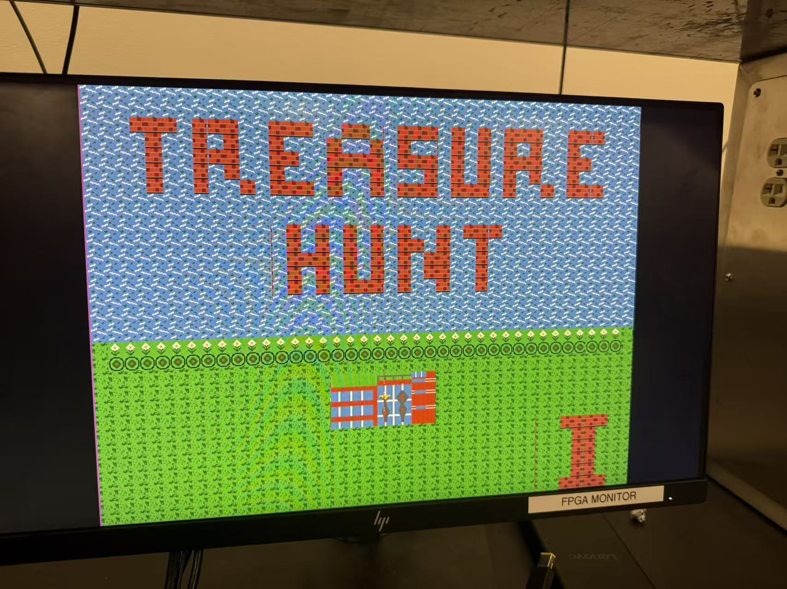

# UIUC Campus Treasure Hunt

ECE 385 Final Project - Fall 2025
Ziheng Qi (zihengq2), Haoru Li (haorul2)

## What is this?

A treasure hunting game on UIUC campus. You walk around collecting treasures, and the last one runs away from you.

## How to run

### Hardware setup
1. Connect HDMI cable to J3 port on the board
2. Plug in USB keyboard
3. Connect micro-USB for programming

### Building in Vivado
1. Open the project and generate bitstream
2. File → Export Hardware (include bitstream)

### Building in Vitis
1. Update hardware specification with the new .xsa file
2. Build the project
3. Run on hardware

The game should show up on your monitor. If you see a black screen, check the HDMI cable is in J3 (not J2).

## How to play

**Controls:**
- WASD to move
- ENTER to start game
- R to restart

**Goal:**
Find and collect all 3 treasures hidden around campus.

**Map:**
- ECEB building (top left)
- Lake with island (top right)
- Alma Mater (bottom left)
- Main Quad (bottom right)

**How it works:**
1. Treasures are hidden at first. Walk around to find them.
2. Get close (within 2 tiles) and the treasure appears.
3. Walk over it to collect.
4. After you collect 2 treasures, the last one will run away when you get close. Chase it down to win.

**Tips:**
- Check the terminal for hints about how close you are
- Treasures can be inside buildings or on grass
- They won't spawn on paths or decorations

